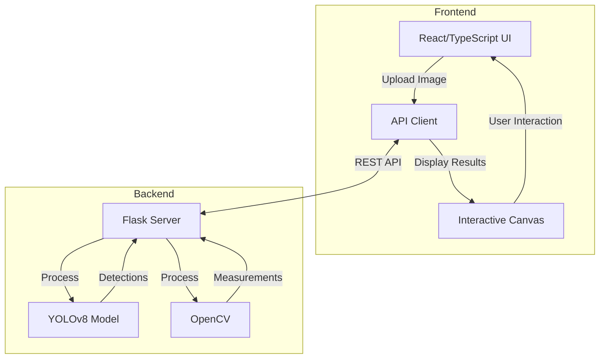
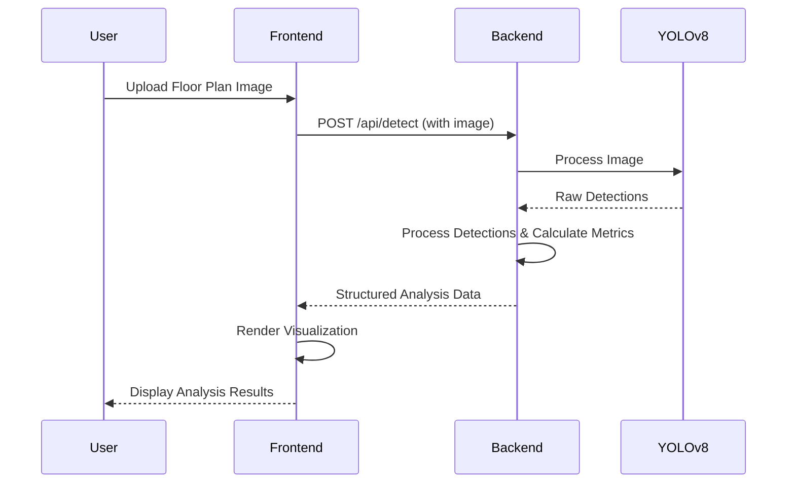
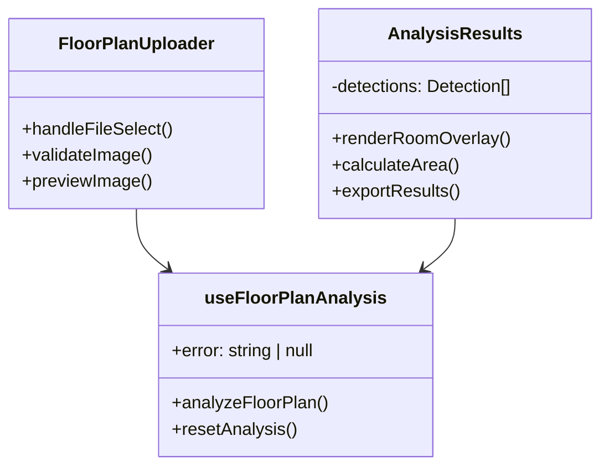

# FloorPlan AI - Turn your Floor plan into a digital plan

A professional SaaS-like web application that uses AI to analyze floor plans and convert them into digital formats with object detection, room mapping, and interactive visualization.

## 🚀 Features

- **AI-Powered Object Detection**: Automatically detect walls, doors, windows, columns, stairs, and other architectural elements
- **Intelligent Room Mapping**: Smart room detection with area calculations
- **Interactive Visualization**: Zoom, pan, and explore your analyzed floor plans
- **Professional Dashboard**: Clean, modern interface with real-time analysis
- **Export Capabilities**: Download analyzed floor plans in various formats
- **Responsive Design**: Works seamlessly on desktop and mobile devices

## 🛠️ Technology Stack

### Frontend
- **React 18** - Modern UI framework
- **TypeScript** - Type-safe development
- **Vite** - Fast build tool and dev server
- **Tailwind CSS** - Utility-first CSS framework
- **shadcn/ui** - Beautiful, accessible UI components
- **React Query** - Data fetching and state management

### Backend
- **Flask** - Python web framework
- **YOLOv8** - State-of-the-art object detection
- **OpenCV** - Computer vision and image processing
- **PyTorch** - Deep learning framework

## 📋 Prerequisites

- **Node.js** (v16 or higher)
- **Python** (v3.8 or higher)
- **pnpm** (recommended) or npm

## 🚀 Quick Start

### 1. Install Frontend Dependencies

```bash
pnpm install
```

### 2. Start Frontend Development Server

```bash
pnpm run dev
```

The frontend will be available at `http://localhost:5173`

### 3. Start Backend Server

In a new terminal window:

```bash
python start_backend.py
```

The backend API will be available at `http://localhost:5000`

## 📁 Project Structure

```
floorplan-ai/
├── src/
│   ├── components/          # React components
│   │   ├── ui/             # shadcn/ui components
│   │   ├── FloorPlanUploader.tsx
│   │   ├── AnalysisResults.tsx
│   │   └── LoadingSpinner.tsx
│   ├── hooks/              # Custom React hooks
│   │   └── useFloorPlanAnalysis.ts
│   └── pages/              # Page components
│       └── Index.tsx
├── api.py                  # Flask backend server
├── helper.py              # Backend utility functions
├── best.pt               # YOLOv8 model weights
└── backend_requirements.txt # Python dependencies
```

## 🔧 Development

### Frontend Commands

```bash
# Install dependencies
pnpm install

# Start development server
pnpm run dev

# Build for production
pnpm run build

# Preview production build
pnpm run preview

# Lint code
pnpm run lint
```

### Backend Setup

The backend uses Flask with YOLOv8 for object detection. The `start_backend.py` script will automatically:

1. Install required Python packages
2. Start the Flask development server
3. Load the YOLOv8 model

### API Endpoints

- `POST /detect` - Analyze floor plan image
- `GET /` - Serve the frontend (when backend is running standalone)

## 🎯 Usage

1. **Upload Floor Plan**: Drag and drop or select a floor plan image (PNG, JPG, JPEG)
2. **AI Analysis**: Click "Analyze Floor Plan" to start the AI processing
3. **View Results**: Explore detected objects, rooms, and measurements
4. **Interactive Visualization**: Switch between original, detections, and rooms views
5. **Export**: Download the analyzed floor plan with annotations

## 🔍 Supported Objects

The AI model can detect:
- Walls
- Doors & Sliding Doors
- Windows
- Columns
- Staircases
- Curtain Walls
- Railings
- Dimensions

## 📊 Analysis Features

- **Object Counting**: Automatic counting of each detected element type
- **Room Detection**: Intelligent identification of enclosed spaces
- **Area Calculation**: Precise area measurements for detected rooms
- **Confidence Scores**: AI confidence levels for each detection
- **Interactive Canvas**: Zoom, pan, and explore analyzed plans

## 🚀 Deployment

### Frontend Deployment

```bash
# Build the frontend
pnpm run build

# The dist/ folder contains the production build
```

### Backend Deployment

The Flask backend can be deployed using:
- **Gunicorn** (recommended for production)
- **Docker** containers
- **Cloud platforms** (AWS, GCP, Azure)

## 🤝 Contributing

1. Fork the repository
2. Create a feature branch
3. Make your changes
4. Run tests and linting
5. Submit a pull request

## 📄 License

This project is licensed under the MIT License.

## 🔗 Links

- [Flask Documentation](https://flask.palletsprojects.com/)
- [YOLOv8 Documentation](https://docs.ultralytics.com/)
- [React Documentation](https://react.dev/)
- [shadcn/ui Components](https://ui.shadcn.com/)

---

**FloorPlan AI** - Transforming architectural drawings into intelligent digital plans with the power of artificial intelligence.

## 📋 System Architecture

### High-Level Architecture



### Data Flow



### Component Architecture



